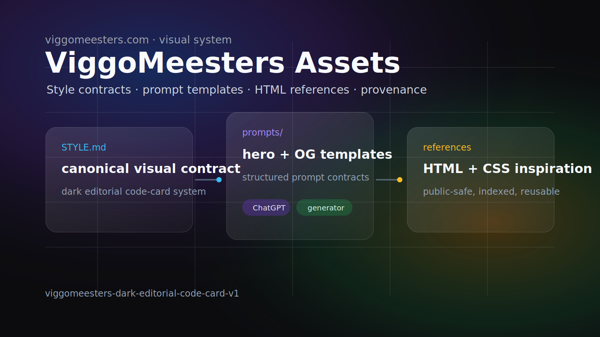

# ViggoMeesters Assets

Public visual assets, prompt templates, style references, and provenance records for `viggomeesters.com`.

**Browse rendered HTML:** https://viggomeesters.github.io/viggomeesters-assets/



This repository is the public-safe source for the ViggoMeesters visual asset system:

- `STYLE.md` — canonical visual style contract.
- `prompts/` — reusable prompt templates for article heroes, Open Graph images, and related static-site assets.
- `assets/references/` — public-safe reference images and descriptions that future image prompts can cite.
- `assets/blog/` — mirrored public article hero images and prompt/provenance records.
- `examples/` — filled prompt examples for published articles.
- `viggomeesters-htmls/` — copied public-site HTML pages that define the canonical viggomeesters.com article/site feel.
- `inspiration-htmls/` — public-safe generic HTML inspiration: beautiful-html templates, rendered anonymized brand HTML templates, and anonymized website examples.
- `style-files/` — no private/client CSS is published; see README there for the anonymization rule.
- `indexes/design-artifacts.md` — searchable index of copied HTML/CSS artifacts with provenance and reuse notes.
- `indexes/public-safety-audit.md` — one-row-per-file check for anonymized name, anonymized content, and rendered/nonblank status.

## Public-safety boundary

Allowed here:

- public website visual language;
- public-safe generated images;
- reusable prompt templates;
- CSS/style experiments that contain no external/private data;
- provenance notes for where a prompt or asset came from.

Forbidden here:

- private knowledge-base content;
- customer names, internal project names, screenshots, tickets, URLs, or data;
- secrets, tokens, cookies, `.env` files, credentials;
- proprietary SAP/customer documentation;
- hidden agent instructions or private runbooks.

## Consumer repos

- `viggomeesters.nl` consumes final hero/OG assets in its static site.
- `viggo-agent-skills` owns the reusable `viggomeesters-asset-prompt` skill.
- A generator workflow such as `reisplanner` may consume this repo as a style/reference pack, but it is not the source of the ViggoMeesters visual style.

## Usage

Use this repo as a style pack when creating a new public `viggomeesters.com` visual asset:

1. Read `STYLE.md`, especially `Explicit viggomeesters.com style`.
2. Pick the closest template from `prompts/`.
3. Use `viggomeesters-htmls/` as the current site/article style anchor.
4. Use `viggomeesters-htmls/design-variants/` only to understand historic ViggoMeesters design exploration.
5. Use `inspiration-htmls/` and `style-files/` only as secondary composition/palette/typography inspiration.
6. Save the generated prompt/provenance record beside the consuming site asset.

Default style sentence for generators:

```text
Match viggomeesters.com: a proof-first personal technical site with a dark static-site portfolio aesthetic, calm editorial code-card composition, readable systems diagrams, subtle aurora/glass accents, precise source-backed labels, and no generic SaaS/stock/cyberpunk styling.
```

Example prompt package:

```text
examples/database-types-agent-first-systems-filled-prompt.md
```

## Development

This repository is intentionally static: Markdown, HTML, CSS, SVG, and prompt templates.

Run local checks before committing:

```bash
git diff --check
scripts/public_safety_audit.py --write
scripts/public_safety_audit.py
# Optional local-only private term scan; keep actual private terms out of the repo.
PUBLIC_SAFETY_EXTRA_REGEX='<semicolon-separated-private-regexes>' scripts/public_safety_audit.py
```

Validation is local-only by design; run the public-safety audit script before publishing changes.

## Installation

No package installation is required. Clone the repository and reference the files directly:

```bash
git clone https://github.com/viggomeesters/viggomeesters-assets.git
cd viggomeesters-assets
```

For Hermes/Codex workflows, use the `viggomeesters-asset-prompt` skill from `viggo-agent-skills`; it reads this repository as its style/reference source.

## License

This repository is released under the MIT License. See `LICENSE`.

## Security and privacy

See `SECURITY.md`. Keep this repository public-safe: no secrets, private knowledge-base content, customer data, internal URLs, or proprietary files.

## Default asset contract

For article assets, save both the rendered image and prompt/provenance:

```text
assets/blog/<slug>-hero.jpg
assets/blog/<slug>-hero.prompt.md
```

Prompt/provenance should identify:

- website and repo consumer;
- article slug/title/date;
- asset type;
- style version;
- template used;
- references used;
- final prompt;
- generation backend if known.

## Generator handoff

A future ChatGPT image generator, reisplanner workflow, or other generator should read this repo as a style pack:

1. `STYLE.md` for the style contract;
2. one template from `prompts/`;
3. `viggomeesters-htmls/` for current site feel and `viggomeesters-htmls/design-variants/` for historic Viggo style variants;
4. optional `inspiration-htmls/beautiful-html-templates/`, `inspiration-htmls/brand-html-templates/`, `inspiration-htmls/website-examples/`, and `style-files/` for layout, palette, typography, and composition cues;
5. one filled example from `examples/`.

The generator is the execution route, not the style source. Save both the generated image and `.prompt.md` provenance in the consuming site repo.
